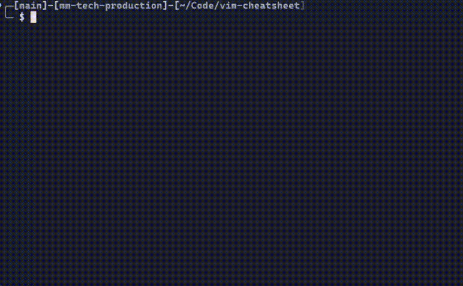

# Vim Cheat Sheet

A quick reference for essential Vim commands, right in your terminal. Bonus, the lazyvim cheatsheet is added!



## Inspiration

Inspired by the [vim for react devs](https://github.com/leerob/vim-for-react-devs) by leerob. Highly recommend this course for beginners.

## How to Use

1. **Download the script(s):**

   * You have multiple options:
     * Clone this repository: `git clone https://github.com/bjarneo/vim-cheatsheet.git`
     * Directly download the `vim_cheatsheet.sh` file from this repository.
     * **Use `curl`:**

       ```bash
       curl -O https://raw.githubusercontent.com/bjarneo/vim-cheatsheet/refs/heads/main/vim_cheatsheet.sh 
       curl -O https://raw.githubusercontent.com/bjarneo/vim-cheatsheet/refs/heads/main/lazyvim_cheatsheet.sh
       ```

2. **Make it executable:**

   * Open your terminal and navigate to the directory where you downloaded the script.
   * Run the following command:

     ```bash
     chmod +x vim_cheatsheet.sh
     ```

3. **Set the alias:**

   * **For Zsh users:**

     * Open your `.zshrc` file:

       ```bash
       vim ~/.zshrc 
       ```

     * Add the following line at the end (replace `/path/to/` with the actual path to your `vim_cheat.sh` file):

       ```bash
       alias vimcheat='/path/to/vim_cheatsheet.sh | less'
       ```

     * Save the file and either restart your terminal or run:

       ```bash
       source ~/.zshrc
       ```

   * **For Bash users:**

     * Open your `.bashrc` file:

       ```bash
       vim ~/.bashrc
       ```

     * Add the following line at the end (replace `/path/to/` with the actual path to your `vim_cheat.sh` file):

       ```bash
       alias vimcheat='/path/to/vim_cheatsheet.sh | less'
       ```

     * Save the file and either restart your terminal or run:

       ```bash
       source ~/.bashrc
       ```

   * **For Fish users:**

     * Open your `config.fish` file (create it if it doesn't exist):

       ```bash
       vim ~/.config/fish/config.fish
       ```

     * Add the following line at the end (replace `/path/to/` with the actual path to your `vim_cheat.sh` file):

       ```fish
       alias vimcheat '/path/to/vim_cheatsheet.sh | less'
       ```

     * Save the file and either restart your terminal or run:

       ```fish
       source ~/.config/fish/config.fish
       ```

4. **Use the cheat sheet:**

   * In your terminal, simply type `vimcheat` to view the cheat sheet in `less` mode.

## Contributing

Feel free to contribute by adding more commands, improving the formatting, or fixing any errors. Pull requests are welcome!

## License

This project is licensed under the MIT License.
